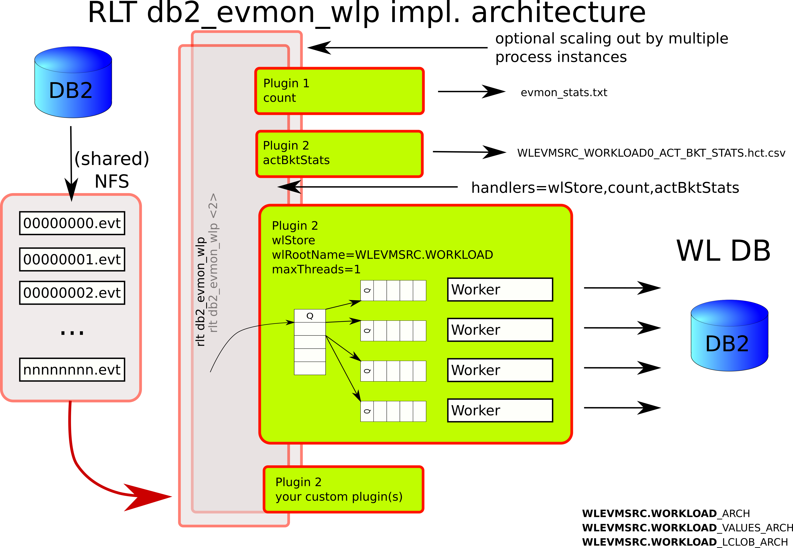

# DBWorkloadProcessor
A set of tools used to capture, analyze workloads, create and execute workload tests for DB2 databases or RDBMS systems in general
To install simply download, check the sha512sum for integrity (optional) then execute
```shell
java -jar rlt_db2wlpt_<build-timestamp>.jar
```
sha256sum -> e702f29ed676458e53012a6612d9522587781559244d7db0dfd9d2f10183cd9b  rlt_db2wlpt_minimal_2019_07_25_12_48_31_800.jar

The solution design is depictred in the diagram bellow:


Command: db2_evmon_wlp implementation architecture


Command: db2_evmon_wlp implementation multi-threaded architecture


