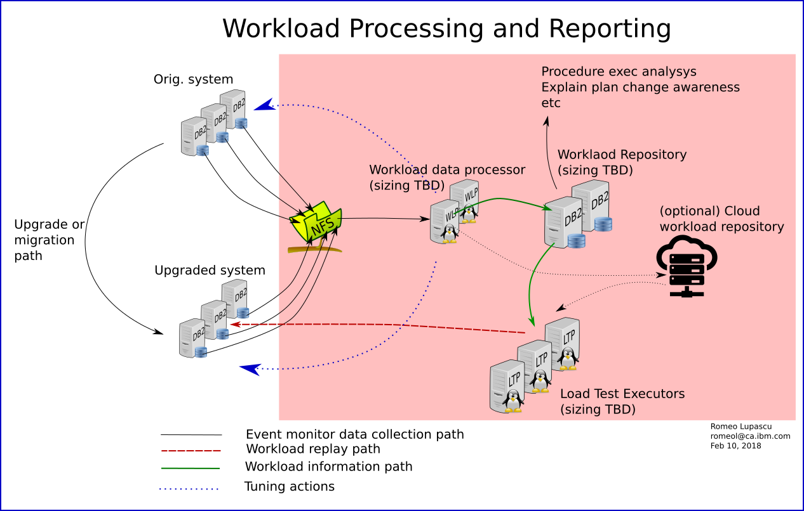
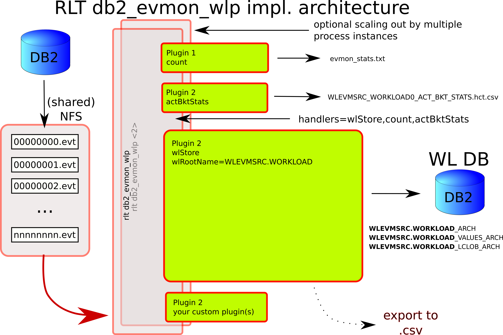

# DBWorkloadProcessor
A set of tools used to cature, analyze workloads, create and execute workload tests for DB2 databases or RDBMS systems in general
To install simply download, check the sha512sum for integrity (optional) then execute
```shell
java -jar rlt_db2wlpt_<build-timestamp>.jar
```
sha256sum for rlt_db2wlpt_minimal_2019_04_22_00_19_17_215.jar is: 0938416a6e835b33bda877800df1605ced619006955a888b8baa89731e9f2e8e

The solution design is depictred in the diagram bellow:




